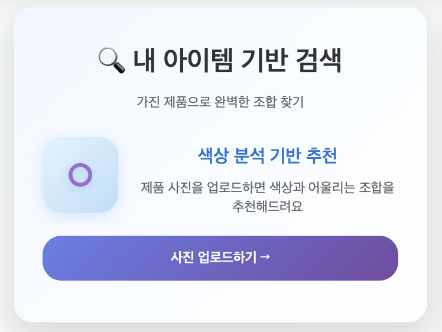

# 🔮 Moodico

나만의 컬러와 무드에 맞춘 메이크업 제품을 한눈에 추천해주는 웹 서비스입니다.

## 🔮 서비스 소개

---

> 나만의 컬러와 무드에 맞춘 메이크업 제품을 한눈에 추천해주는 웹 서비스

> URL : [서비스 링크]

## 💻 Developers

---

- 프로젝트 기간: 2025.07~2025.08 (3주)

| **조가람**                                    | **남유찬**                            | **김지은**                        | **진웨이얀**                        | **이유석**                                |
| --------------------------------------------- | ------------------------------------- | --------------------------------- | ----------------------------------- | ----------------------------------------- |
| [river040118](https://github.com/river040118) | [namu627](https://github.com/namu627) | [j2nii](https://github.com/j2nii) | [ZinYan](https://github.com/ZinYan) | [notory678](https://github.com/notory678) |
| PM/FE                                         | FE                                    | BE                                | BE                                  | BE                                        |

## 🔩 Tech Stack

---

### **Backend & Framework**

- **Django 5.2.4** - 메인 웹 프레임워크
- **Python 3.x** - 백엔드 개발 언어
- **SQLite** - 개발용 데이터베이스
- **WSGI/ASGI** - 웹 서버 게이트웨이 인터페이스

### **Data Processing & Machine Learning**

- **NumPy** - 수치 계산 및 배열 처리
- **scikit-learn** - 클러스터링 알고리즘 (K-Means)
- **scikit-image** - 이미지 처리 및 색상 변환
- **OpenCV** - 이미지 분석 및 색상 추출

### **Web Scraping & Automation**

- **Selenium** - 동적 웹페이지 크롤링
- **Requests** - HTTP 요청 및 API 통신
- **BeautifulSoup** - HTML 파싱

### **Authentication & Security**

- **Django Auth** - 기본 사용자 인증 시스템
- **카카오 OAuth 2.0** - 소셜 로그인
- **CSRF 보호** - 보안 강화

### **Frontend & UI**

- **HTML5/CSS3** - 반응형 웹 디자인
- **JavaScript (ES6+)** - 동적 색상 매트릭스 구현
- **Canvas API** - 색상 좌표계 시각화

### **Deployment & Cloud**

- **AWS S3** - 이미지 저장소
- **django-storages** - 클라우드 스토리지 연동
- **GitHub Actions** - CI/CD 파이프라인

### **Development Tools**

- **django-crontab** - 주기적 작업 스케줄링
- **Django Admin** - 데이터 관리 인터페이스
- **Management Commands** - 커스텀 Django 명령어

---

## 🔮 사용 예시

---

### 1. 무디코 & 톤/무드 활용법 소개

- 톤/무드를 활용할 수 있는 방법에 대한 간단한 소개
- 무디코 활용법 소개

### 2. 내 아이템 기반 검색

- 크롤링 된 데이터 기반 제품 검색 → 유사 톤/무드 제품 추천 기능
- 업로드 한 사진에서 색 추출 → 유사 톤/무드 제품 추천 기능
- 추천 제품 → 올리브영 정보

- DB에 업로드 된 제품 내 추천

- 업로드한 사진 색상 추출 기반 추천

- 립/블러셔/아이섀도우 세 종류로 분류하여 제품 추천 제공

- 올리브영 제품 추천 정보 모아보기

### 3. 오늘의 추천

- 내가 찜한 제품 중 랜덤 추천 기능 → 사용자 리마인드 기능

### 4. 무드 테스트

- 10개의 간단한 설문
- 러블리/시크/내추럴/캐주얼/고급스러운/모던/청순/힙에 맞는 추천 결과 제공

### 5. 색상 매트릭스 바로가기

- 찜/무드별/제품기능별 필터링 기능 제공

- 무드 박스를 조정해 원하는 구역의 제품 모아보기 기능

### 6. 컬러 투표

- 해당 일자 자정 기준 상위 1위, 2위 제품 인기투표 경선 기능

### 7. 현재 인기 아이템 순위 제공

- 찜 수를 기준으로 상위 아이템 표시
- 상위 10 제품에 대한 정보 제공
- 립/블러셔/섀도우 기능 필터링

### 8. 찜한 아이템 모아보기 기능

- 찜한 아이템 모아보기 제공
- 찜한 아이템기반 개인 매트릭스 제공 → 사용자의 선호 무드 확인가능

### 9. 로그인

- 기본 로그인/카카오 로그인 제공
- 마이페이지에서 나의 무드/내가 작성한 리뷰/찜한 제품 확인 가능

### 10. 제품 상세페이지 / 리뷰

- 제품 매트릭스 위치/가격 제공
- 구매하기 버튼 → 해당 브랜드 구매 페이지로 연결
- 제품별 별점/리뷰 기능

