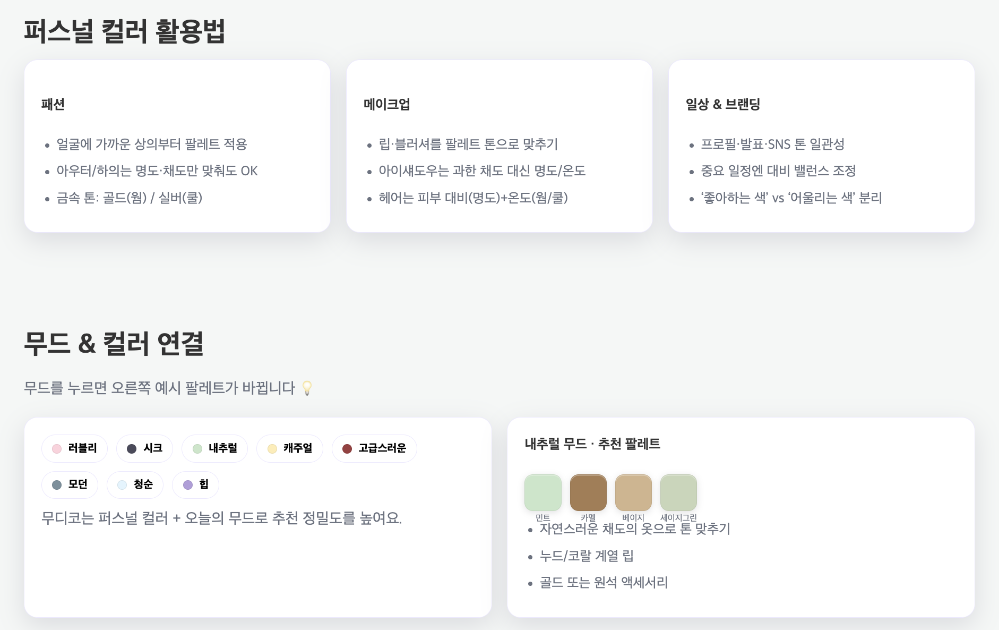

# Moodico
나만의 컬러와 무드에 맞춘 메이크업 제품을 한눈에 추천해주는 웹 서비스입니다.
## 🔮 서비스 소개

---

> 나만의 컬러와 무드에 맞춘 메이크업 제품을 한눈에 추천해주는 웹 서비스
> 

> URL :
> 

# **💻 Developers**

---

- 프로젝트 기간: 2025.07~2025.08 (3주)

| **조가람**
[river040118**river040118**](https://github.com/river040118) | **남유찬**
[namu627**namu627**](https://github.com/namu627) | **김지은**
[j2nii**j2nii**](https://github.com/j2nii) | **진웨이얀
[ZinYan](https://github.com/ZinYan)** | **이유석**
[notory678**notory678**](https://github.com/notory678) |
| --- | --- | --- | --- | --- |
|  |  |  |  |  |
| PM/FE | FE | BE | BE | BE |

# 🔩 Tech Stack

---

# 🔮 사용 예시

---

### 1. 무디코 & 톤/무드 활용법 소개

- 톤/무드를 활용할 수 있는 방법에 대한 간단한 소개
- 무디코 활용법 소개

### 2. 내 아이템 기반 검색

- 크롤링 된 데이터 기반 제품 검색 → 유사 톤/무드 제품 추천 기능
- 업로드 한 사진에서 색 추출 → 유사 톤/무드 제품 추천 기능
- 추천 제품 → 올리브영 정보

- DB에 업로드 된 제품 내 추천

- 업로드한 사진 색상 추출 기반 추천

